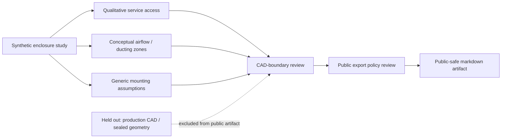

# Synthetic Enclosure Study

Status: `scaffolded`  
Artifact type: synthetic public-safe mechanical study

## Problem Statement

A mechanical design study needs to show enclosure reasoning, service access, airflow considerations, and CAD boundary review without exposing production F3D files, production CAD, exact product dimensions, manufacturing package material, product geometry, customer parts, private rack models, internal company product names, production thermal posture, customer-sensitive design context, or sealed geometry.

## Current Status

`scaffolded`

This artifact is a local-only public-safe design study. It is not `published`, not `released`, and not approved for CAD export, render, screenshot, profile routing, or proof-stack routing.

## Synthetic Non-Production Enclosure Context

This study uses an invented non-production enclosure class with qualitative access, airflow, and mounting zones. It is not based on a real product, production CAD model, customer part, manufacturing package, sealed geometry, or internal product design.

The purpose is to document how public mechanical reasoning can be written before any CAD export exists. The study is a boundary-safe design note, not a drawing package, BOM, fabrication instruction, or product readiness claim.

## Assumptions And Constraints

| Topic | Public-safe assumption | Boundary limit |
| --- | --- | --- |
| Enclosure class | Synthetic non-production enclosure | Not a released product, customer part, or production CAD model. |
| Scale | Qualitative small rack-adjacent class | No exact product dimensions, private measurements, or product geometry. |
| Access | Front removable panel concept | Not a production drawing, service manual, or manufacturing package. |
| Mounting | Generic fastener family and generic support points | Not a BOM, supplier selection, customer part, or private rack model. |
| Airflow | Conceptual inlet, outlet, and obstruction zones | Not production thermal posture, CFD output, measured test data, or production ducting. |
| Export posture | Markdown-only public-safe study | No STEP, STL, F3D, render, screenshot, drawing, or generated output without review. |
| Review gate | Human CAD-boundary review required before publication | Does not authorize GitHub publication, metadata changes, or proof-stack routing. |

## Serviceability Notes

- Access zones are qualitative and do not describe real panel geometry.
- Panel removal is conceptual and not a service procedure.
- Cable routing is abstract and not tied to customer infrastructure or internal product layout.
- Clearance language must stay qualitative and cannot imply private dimensions.
- Any public image, CAD export, render, screenshot, or generated output requires review before it can be added.

## Airflow / Ducting Considerations

The study identifies conceptual inlet, outlet, bypass, and obstruction zones. These zones are used only to reason about documentation structure.

This artifact does not include measured thermal data, production thermal posture, production ducting, sealed geometry, customer-sensitive design context, internal product geometry, or private test results.

## Mounting And Fastener Assumptions

Mounting is described by generic fastener families, generic support points, and qualitative access rules. No exact part, supplier, BOM, torque value, hole pattern, production bracket, or customer part is included.

Fastener and mounting notes are included only to show how a public-safe design study can name review topics without exposing manufacturing details.

## Mechanical Reasoning Notes

- The enclosure is treated as a synthetic study object, not as a product, manufacturing package, production CAD model, or customer part.
- Service access is discussed as a qualitative relationship between panels, clearance, airflow, and generic mounting, not as exact product geometry.
- Airflow and ducting notes identify conceptual review topics without publishing production thermal posture, measured results, or sealed geometry.
- Mounting assumptions stay generic so the study can reason about maintainability without revealing exact dimensions, fastener specifications, private rack models, or supplier details.
- Export review is part of the mechanical reasoning chain because screenshots, CAD files, renders, and generated outputs can carry boundary-sensitive detail.
- The study remains useful only if each design statement can be traced to a public-safe assumption and a documented boundary limit.

## Public Export Policy Reference

See `public-safe-cad-exports/export-policy.md` before adding screenshots, STEP/STL, renders, or generated outputs.

No export is authorized by this study. Export decisions remain held for human CAD-boundary review.

## Mermaid Mechanical Boundary Diagram

## Design Review Questions

- Does every mechanical claim remain synthetic, qualitative, and public-safe?
- Does the study avoid production F3D files, production CAD, exact product dimensions, product geometry, and manufacturing package material?
- Are airflow and ducting statements limited to conceptual review topics rather than production thermal posture or measured performance?
- Are mounting and fastener notes generic enough to avoid BOM, supplier, customer part, or private rack model disclosure?
- Does the public export policy gate any future screenshot, STEP/STL, render, generated output, or drawing?
- Does the artifact clearly remain `scaffolded` and local-only until human CAD-boundary review approves any public route?

## What This Proves

This proves a public-safe method for documenting mechanical design reasoning, serviceability considerations, airflow topics, mounting assumptions, and CAD-boundary review gates without releasing CAD files or production geometry.

It also proves that an enclosure study can be useful as a professional review artifact while remaining synthetic, qualitative, and local-only.

## What This Does Not Prove

This does not prove production readiness, manufacturability, certification, released CAD, exact dimensions, exact product dimensions, product geometry, customer suitability, thermal performance, structural performance, procurement readiness, or deployment readiness.

## CAD-Boundary Review Checklist

- [ ] Current status remains `scaffolded`.
- [ ] No production F3D files.
- [ ] No production CAD.
- [ ] No exact product dimensions.
- [ ] No manufacturing package.
- [ ] No product geometry.
- [ ] No customer parts.
- [ ] No private rack models.
- [ ] No internal company product names.
- [ ] No sealed geometry.
- [ ] No production thermal posture.
- [ ] No customer-sensitive design context.
- [ ] No screenshot, render, CAD export, generated output, or drawing added without review.
- [ ] Public export policy reviewed before any future external artifact is created.
