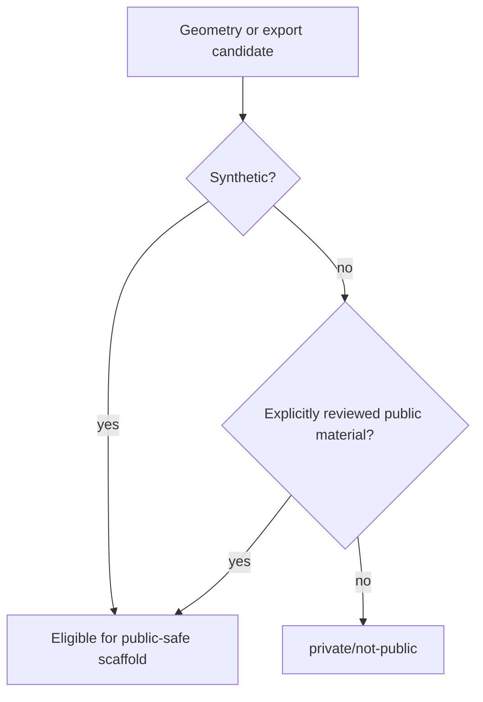

# Geometry Release Decision Tree

Status: `scaffolded`

Hold the candidate as `private/not-public` if it includes production F3D files, production CAD, exact product dimensions, manufacturing package, product geometry, customer parts, private rack models, internal company product names, or sealed geometry.
